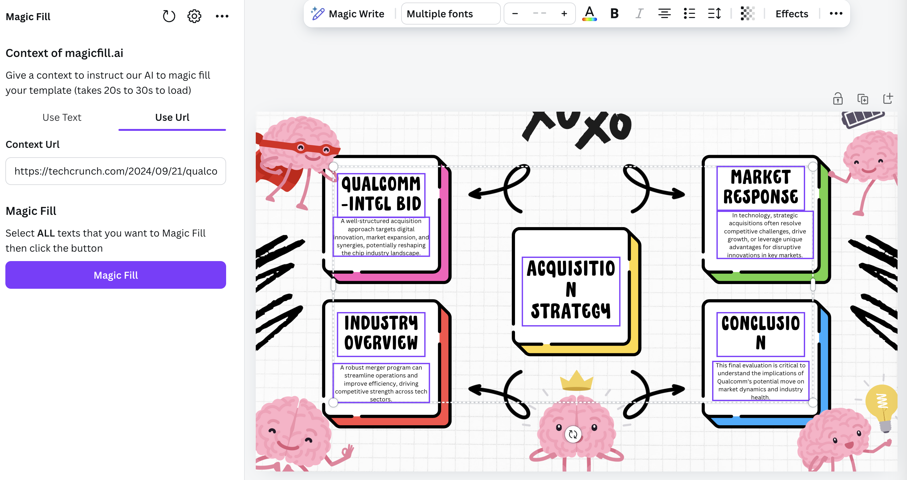

# Magic Fill

### A Canva App that fills all texts in your template within one-click

Magic Fill allow you to pass in a context in text or url format, then fill all selected texts in your template with AI. It fits your placeholders well.

